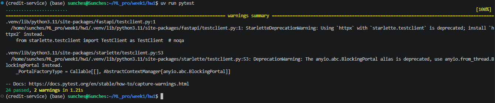
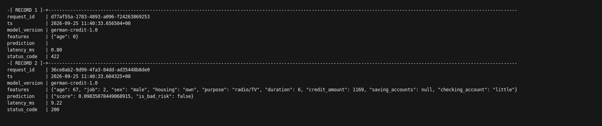
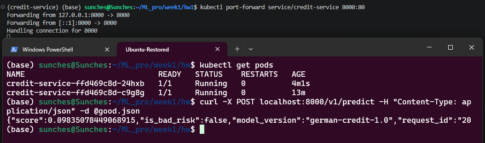
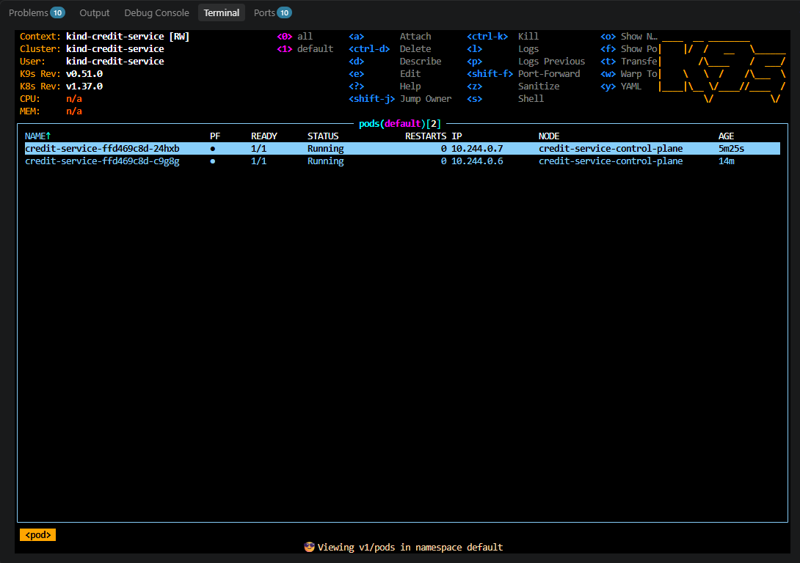

# Credit service

FastAPI-сервис кредитного скоринга на модели, обученной в
[`notebooks/train.ipynb`](notebooks/train.ipynb). Артефакт содержит единый
scikit-learn Pipeline с препроцессингом и моделью, а также паспорт модели.

## Проверка

Команды выполняются из корня проекта сверху вниз.

1. Установка зафиксированных зависимостей и тесты:

   ```bash
   uv sync --frozen && uv run pytest
   ```

2. Сборка и проверка API с журналом предсказаний в PostgreSQL:

   ```bash
   bash scripts/check-compose.sh
   ```

3. Сборка образа, развёртывание в kind и запрос через port-forward:

   ```bash
   bash scripts/check-kind.sh
   ```

## Отчёт

### Тесты



### Логи предсказаний в PostgreSQL

В таблице видны идентификатор и время запроса, версия модели, входные признаки,
предсказание, задержка и HTTP-код ответа.



### Kubernetes и predict

Deployment запущен в двух репликах. На скриншоте также показан ответ
`/v1/predict`, полученный через port-forward.



### k9s



## Журнал проблем
Особых проблем не было, все имеющиеся возникли в результате невнимательности и были быстро исправлены


1. При запросе `localhost:8000` к Kubernetes-сервису curl возвращал
   `Failed to connect`. `kubectl get service` показал тип `ClusterIP`, который
   не публикует порт на хосте. Для проверки был запущен port-forward из порта
   Service 80 на локальный порт 8000.

3. При удалении и повторном создании kind-кластера ConfigMap, созданный вручную,
   исчез. Проверка манифестов теперь не зависит от объектов, отсутствующих в
   каталоге `k8s`.

## Данные и артефакт

Источник и контрольная сумма обучающего CSV записаны в
[`artifact/metadata.json`](artifact/metadata.json). Инструкция по размещению
исходного файла для повторного запуска ноутбука находится в
[`datasets/README.md`](datasets/README.md).
